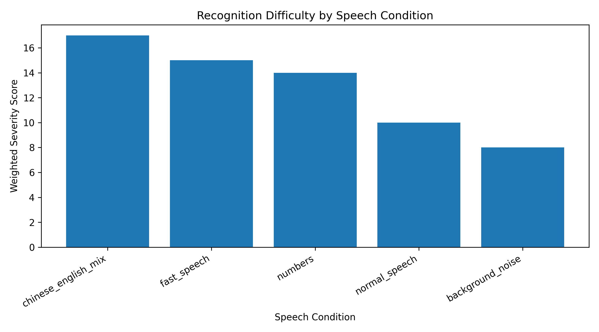
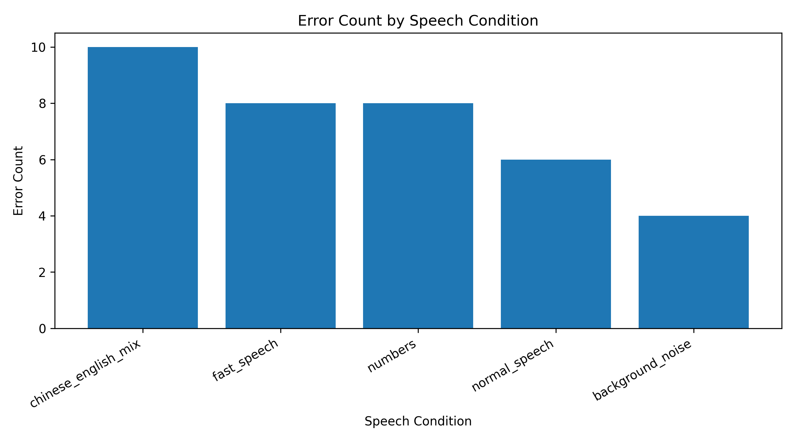

# Chinese Speech Annotation & Evaluation Portfolio

## Project Overview

This project evaluates the performance of OpenAI Whisper on Mandarin speech under different speaking conditions.

I collected speech samples, created human transcripts, compared them with model-generated transcripts, and analyzed recognition errors across multiple scenarios.

The goal was to simulate the workflow of a Speech Data Annotator and investigate how factors such as speaking speed, background noise, numerical expressions, and Chinese-English code-switching affect transcription quality.

## Dataset

Five audio recordings were collected:

- Normal speech
- Fast speech
- Background noise
- Numerical expressions
- Chinese-English mixed speech

## Methodology

For each audio sample:

1. Record and store audio
2. Generate transcripts using Whisper
3. Create human reference transcripts
4. Compare model output against reference transcripts
5. Categorize transcription errors
6. Document observations and findings

### Evaluation Framework

Severity scores were determined using two factors:

1. Total transcription error count
2. Impact of the errors on meaning preservation

As a result, scenarios with the same number of errors could receive different severity scores.

## Results

### Recognition Difficulty by Speech Condition

### Interpretation

This chart shows weighted severity scores across different speech conditions. Chinese-English mixed speech produced the highest severity score, followed by fast speech and numerical expressions.

---

### Error Count by Speech Condition

### Interpretation

This chart shows the total number of transcription errors identified in each speech condition. Chinese-English mixed speech generated the highest number of errors, followed by fast speech and numerical expressions.

## Key Findings

| Scenario | Main Observation |
|----------|------------------|
| Normal speech | Mostly homophone-related errors |
| Fast speech | Increased phrase-level recognition errors |
| Background noise | Caused distortion of multi-word phrases |
| Numbers | Struggled with informal monetary expressions |
| Chinese-English mix | Frequent failures on English technical terms |

### Examples

- 大模型 → 大魔行
- 历史 → 地址
- 学习环境 → 水喜欢鸡
- 二毛五 → 2.5
- Python → 拍賞

## Skills Demonstrated

- Speech transcription
- Data annotation
- Error categorization
- Mandarin language evaluation
- Chinese-English code-switching analysis
- Python scripting
- ASR model evaluation

## Conclusion

This evaluation suggests that OpenAI Whisper performs reliably on conversational Mandarin speech, but recognition quality decreases when speech contains code-switching, rapid delivery, or informal numerical expressions.

Among the tested conditions, Chinese-English mixed speech produced the highest error counts and severity scores, making it the most challenging scenario for automatic speech recognition.